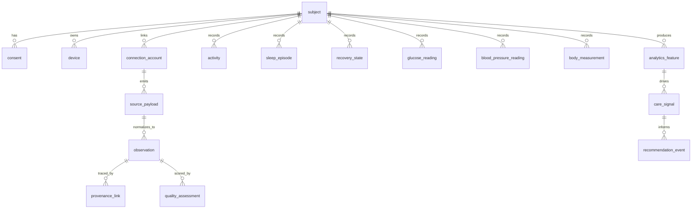

# OpenPulse Standard v1.0.0

## Purpose
OpenPulse Standard defines a stable, vendor-friendly canonical protocol for wearable and sensor data ingestion, normalization, provenance, and analytics.

## Design Principles
1. API-first and event-native with batch compatibility.
2. Backward compatibility by default with explicit semantic versioning.
3. Every normalized fact carries source provenance.
4. Preserve original units while normalizing canonical values.
5. Keep open core stable while allowing namespaced manufacturer extensions.
6. Enforce consent and pseudonymization before downstream analytics use.

## Canonical Core Entities
- subject
- consent
- manufacturer
- device
- device_capability
- connection_account
- source_payload
- observation
- observation_series
- session
- activity
- sleep_episode
- recovery_state
- glucose_reading
- body_measurement
- blood_pressure_reading
- quality_assessment
- normalization_run
- provenance_link
- care_signal
- analytics_feature
- recommendation_event

## Time Semantics
All records support these time semantics where applicable:
- event_time: clinical/business time the event occurred.
- observed_time: time the sensor sample was observed.
- device_time: on-device timestamp.
- received_time: ingestion gateway receipt time.
- processed_time: normalization processing time.

## Observation Taxonomy
Canonical metric families:
- heart_rate
- hrv_rmssd
- sleep_duration and sleep_stage
- steps
- energy_burned
- respiratory_rate
- spo2
- skin_temperature
- stress_score
- recovery_score and readiness_score
- blood_pressure_systolic / blood_pressure_diastolic
- body_weight / body_fat_percent
- glucose
- menstrual_phase (optional)

Future biosignals are accepted through namespaced extensions and capability declarations.

## Event Model
### Ingest Envelope
Every source event is wrapped in a normalized envelope:
- envelope_id
- manufacturer
- subject_id
- connection_id
- idempotency_key
- source_endpoint
- source_payload
- received_time
- optional device descriptor

### Canonical Observation Event
Each normalized observation includes:
- metric_code, value/value_text, canonical and original unit/value
- quality_score, completeness_score, confidence_score
- clinical_grade (consumer or clinical)
- event_time and related timestamps
- extension_namespace + extension_payload (if used)

## Normalization Rules
1. Validate manufacturer-specific payload shape.
2. Extract metric candidates and canonical event_time.
3. Normalize units into canonical SI-compatible set.
4. Preserve source value/unit in original fields.
5. Score quality/completeness/confidence.
6. Attach provenance hash and mapping version.
7. Emit rejected records with explicit reason.

## Units and Semantic Conventions
- Heart rate: `beats/min`
- HRV RMSSD: `ms`
- Sleep duration: `min`
- Steps: `count`
- Energy: `kcal`
- Respiratory rate: `breaths/min`
- SpO2: `%`
- Temperature: `degC`
- Blood pressure: `mmHg`
- Glucose: `mg/dL`

## Versioning and Compatibility
- Semantic versioning: MAJOR.MINOR.PATCH.
- MAJOR: breaking schema or behavior changes.
- MINOR: additive backward-compatible fields/metrics.
- PATCH: clarifications and bug fixes without contract change.
- Breaking change requires governance approval from `openpulse-governor-jeff`.

## Extension Mechanism
- `extension_namespace` must follow `openpulse.ext.<manufacturer-or-domain>`.
- Extension payloads are JSON objects validated by namespace-specific schema.
- Open core fields remain stable and required when applicable.
- Premium/private extensions must not alter canonical field meaning.

## Privacy, Security, Compliance Notes (non-legal advice)
- Consent enforcement is mandatory before data export.
- Subject IDs can be pseudonymized deterministically with configurable salt.
- Audit trails required for ingest, normalization, overrides, and exports.
- Encrypt payload transport (TLS in production) and protect secrets.
- Retention policy should separate operational payload retention from aggregated analytics retention.

## FHIR/HL7 Alignment Strategy
- OpenPulse stays lightweight and event-oriented.
- FHIR-aligned export views map normalized observations to FHIR Observation and Device resources.
- OpenPulse avoids importing full FHIR object complexity into ingest and internal event contracts.

## Manufacturer Mapping Strategy
- Map shared physiological concepts to core metrics.
- Preserve vendor differentiation in extension namespace.
- Maintain capability registry and lossiness matrix for transparent tradeoffs.

## Compatibility and Conformance Policy
- All adapters must pass conformance kit:
  - schema validity
  - required time semantics
  - provenance linkage
  - unit normalization with original-value preservation
  - idempotency behavior
- Each release includes changelog, migration notes, and updated compatibility matrix.

## Canonical ERD (Mermaid)

